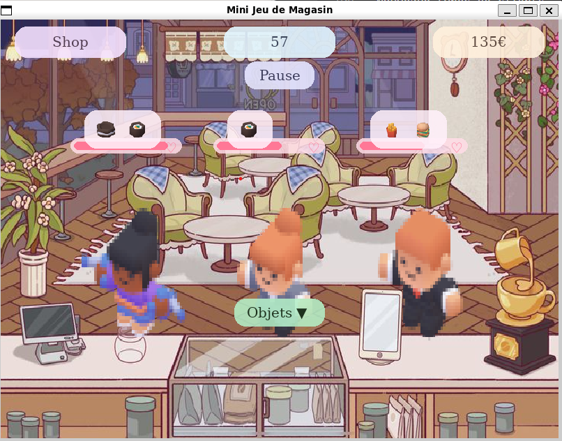
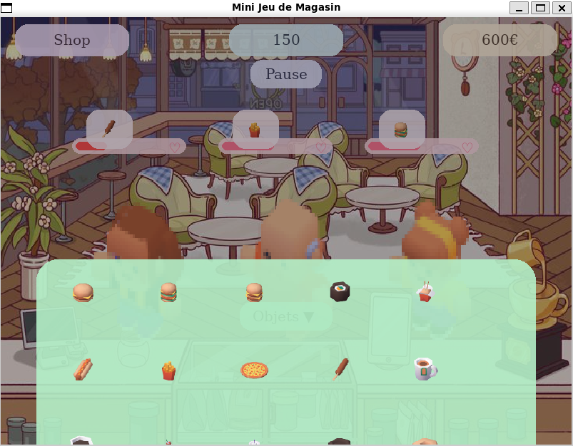
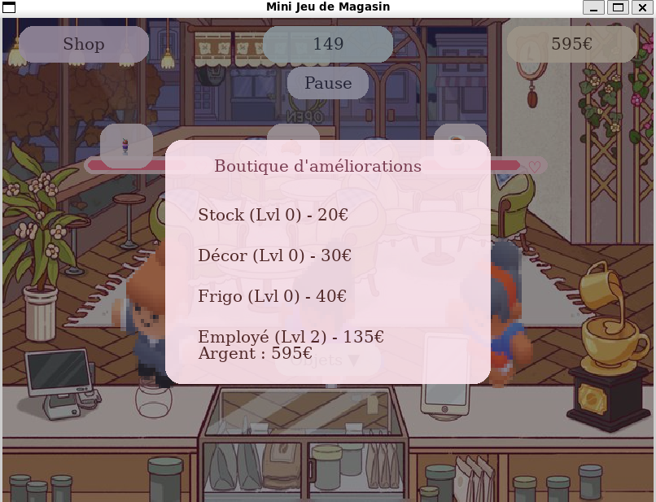

☕ Cozy Café 

🎮 Présentation générale
Dans Cozy Café, vous incarnez le gérant d’un petit café chaleureux.
L’objectif est simple : satisfaire un maximum de clients avant qu’ils ne perdent patience.
Chaque client arrive avec une commande spécifique, une barre de patience et une humeur qui évolue selon la qualité du service.

Le jeu combine réactivité, gestion des priorités, optimisation des ressources et progression stratégique grâce à un système d’améliorations.

## Aperçu du jeu

🧩 Fonctionnalités principales
• Gestion des commandes
Chaque client demande un ou plusieurs items (burgers, boissons, desserts…).
Le joueur doit ouvrir le menu des objets, sélectionner l’item approprié et le glisser-déposer sur le client.

• Barre de patience dynamique
La patience diminue progressivement.
Si elle atteint zéro, le client repart mécontent et le joueur perd une opportunité de marquer des points.

• Système d’améliorations (Shop)
Le jeu propose quatre axes d’amélioration :

Stock : augmente les gains par commande

Décor : augmente la patience initiale des clients

Frigo : réduit la vitesse de perte de patience

Employé : permet un service automatique périodique

Chaque amélioration possède un niveau, un coût et un impact direct sur la performance du café.

• Service automatique
À partir d’un certain niveau d’employé, un client est servi automatiquement après un délai dépendant du niveau d’amélioration.

• Tutoriel intégré
Un écran d’introduction explique les bases du gameplay avant la première partie.

• Mode pause
Un bouton dédié permet de suspendre la partie à tout moment.

• Système de sauvegarde automatique
Le jeu enregistre automatiquement :

Score

Argent

Niveaux d’améliorations

Le joueur peut reprendre sa partie à tout moment.

🖼️ Interface et direction artistique
Cozy Café adopte une esthétique pastel douce et accueillante.
L’interface utilise :

Des menus arrondis

Des overlays semi-transparents

Des bulles de commandes

Des barres de patience stylisées

Des icônes d’items redimensionnées pour une lisibilité optimale

Des émoticônes de satisfaction (heureux / fâché)

L’ensemble crée une ambiance cozy, simple à lire et agréable à jouer.

🕹️ Contrôles
Clic gauche : sélectionner un item, servir un client

Glisser-déposer : déposer un item sur un client

Molette : défiler dans le menu d’objets

Bouton “Objets” : ouvrir/fermer le menu des items

Bouton “Shop” : ouvrir la boutique d’améliorations

Bouton “Pause” : mettre le jeu en pause

📦 Installation
1. Installer les dépendances
Assurez-vous d’avoir Python 3.x puis installez Pygame :
bash
pip install pygame
2. Lancer le jeu
Placez tous les fichiers nécessaires dans le même dossier (dont test_client.py et le dossier images/), puis exécutez :
bash
python main.py

📁 Structure du projet
Code
CozyCafe/
│── main.py
│── test_client.py
│── save.json (généré automatiquement)
│── images/
│   ├── backgrounds/
│   ├── items/
│   └── ui/
🚀 Améliorations futures possibles
Ajout de sons et musique
Nouveaux types de clients

Animations supplémentaires

Système de combos ou bonus

Événements aléatoires (rush, clients VIP)

Plus d’items et de recettes

👤 Auteur
Projet développé par Sarra Boukadida.